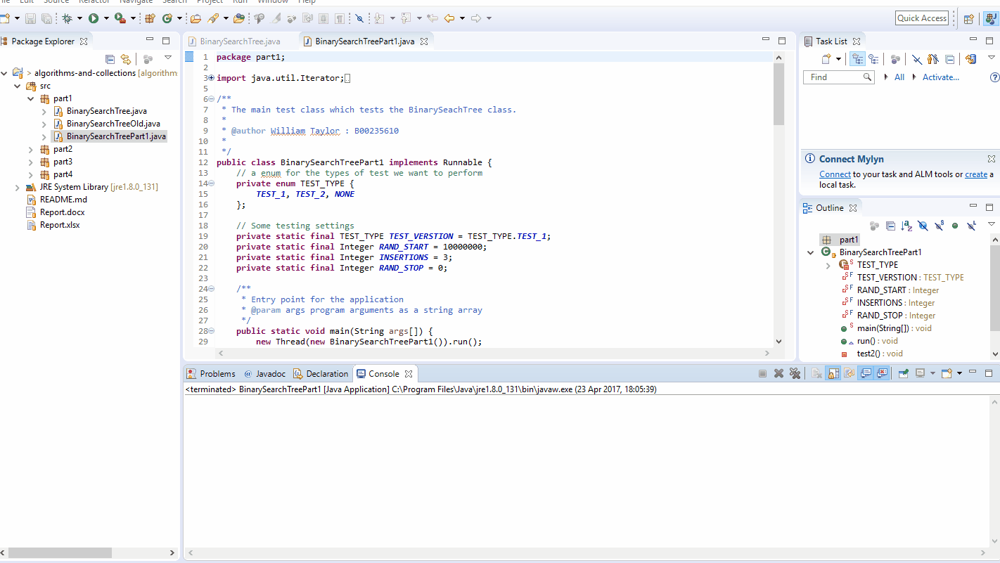

# Algorithms &amp; Collections &nbsp; 

The algorithms and collections module taught unsurprisingly algorithms and collections. It was assessed with both an exam and a coding assignment. All algorithms and collection tutorials and lectures were taught using Java and the Java Collection Framework. Even though the course until this point had only focused on C++ this gave students a new opportunity to better understand a new and popular language as well as learning fundamental concepts to computer science. 
 
## Assignment

The assignment was to take a basic binary tree implementation and extend it to be more efficient and useful. Then compare it with the traditional binary tree found in the Java Collections Framework the `TreeSet`. Which is internally implemented as a binary search tree.

**Tasks**
* Implement Extended Binary Tree
* Insert elements at the root
* Compare with a Red Black Tree (`TreeSet`)
* Implement Serialization

## Submission

A full extensive report was given comparing the Extended Binary Tree with the Java `TreeSet` as was the Java code which met all requirements of the assignment. I fully met the requirements for all four sections and thus had the best mark in my class for the module coursework.

## License

MIT